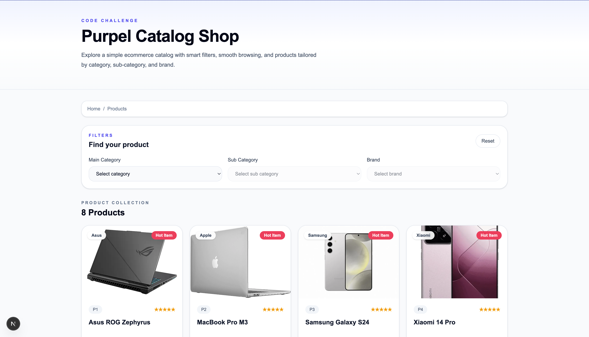
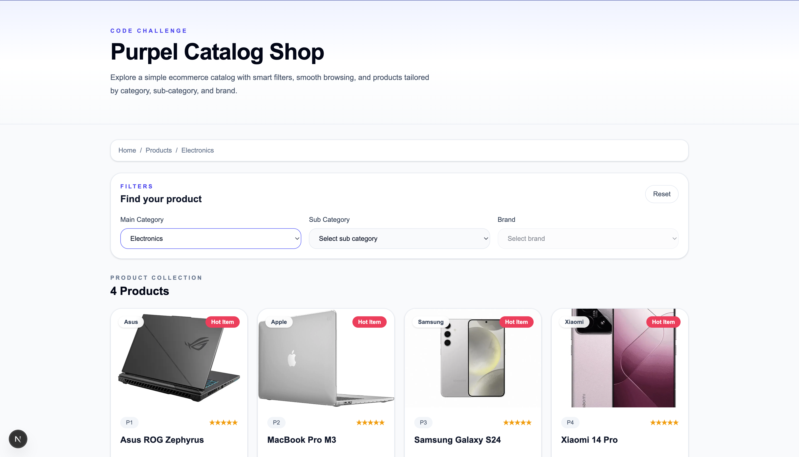
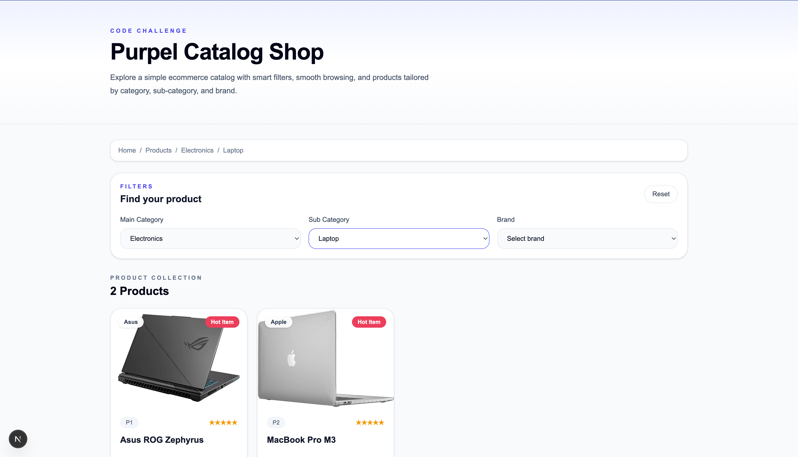
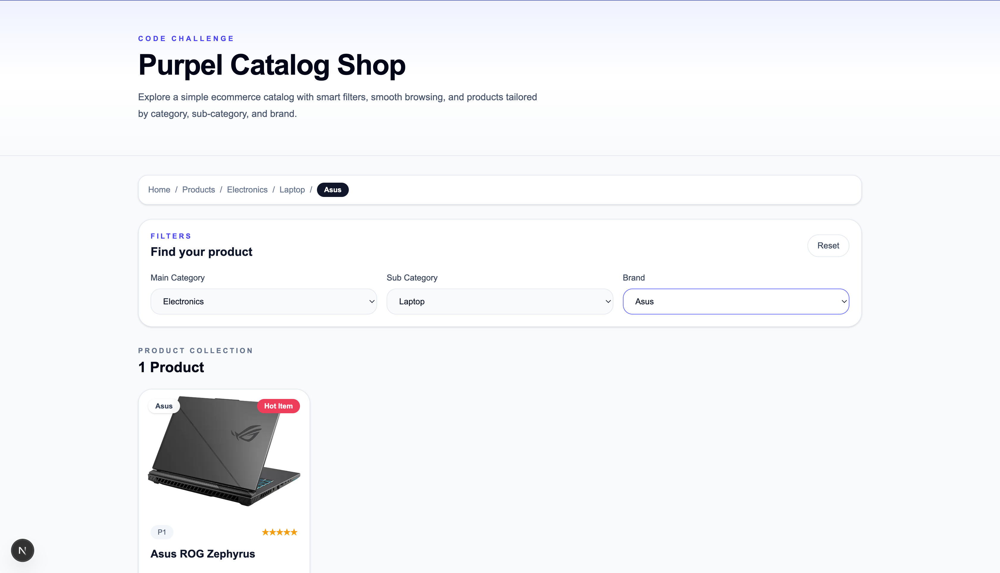

# Purpel Product Catalog

Explore a simple ecommerce catalog with smart filters, smooth browsing,
and products tailored by category, sub-category, and brand.

## Preview

Features included in the app:
- Cascading filter flow: category → sub-category → brand
- URL search params as source of truth
- Dynamic breadcrumb updates
- Reset filter functionality
- Responsive ecommerce-style product cards
- Product images and product-specific descriptions

## Tech Stack

- Next.js
- React
- TypeScript
- Tailwind CSS

## Objective

Build a dynamic product catalog page with cascading dropdown filters. The application should handle dependent states correctly, keep filter state persisted in the URL, and update the UI dynamically based on the selected filters.

## Functional Highlights

### 1. Cascading Dropdown Filters
- Main Category is populated on initial load
- Sub-Category stays disabled until a category is selected
- Brand stays disabled until a sub-category is selected
- Available options always depend on the previous selection

### 2. URL-Based State Persistence
Selected filters are stored in the URL query string, so the state is preserved after refresh.

Example:

```bash
/?category=C1&subcategory=S1&brand=B1
```

### 3. Dynamic Breadcrumb
Breadcrumb content updates automatically based on the selected filter combination.

### 4. Reset Filter
The reset button clears all selected filters and returns the page to its initial state.

### 5. Responsive Product Grid
Products are displayed in a clean ecommerce-style card layout with:
- product image
- brand badge
- product name
- product description
- formatted price

## Project Structure

```bash
.
├── app/
│   ├── globals.css
│   ├── layout.tsx
│   └── page.tsx
├── components/
│   ├── breadcrumb.tsx
│   ├── filter-panel.tsx
│   └── product-grid.tsx
├── data/
│   └── catalog.ts
├── lib/
│   └── catalog.ts
├── public/
│   └── products/
├── package.json
└── README.md
```

## How It Works

### Data Layer
The app uses local dummy data for:
- categories
- subCategories
- brands
- products

Each product contains:
- `id`
- `brandId`
- `name`
- `price`
- `image`
- `description`

### Filtering Logic
The filtering behavior is implemented in utility functions:
- get sub-categories based on selected category
- get brands based on selected sub-category
- filter products based on current selection

### UI Flow
1. User selects a main category
2. Matching sub-categories become available
3. User selects a sub-category
4. Matching brands become available
5. Product list and breadcrumb update automatically

## Installation

Clone the repository:

```bash
git clone https://github.com/your-username/product-catalog-challenge.git
```

Go into the project directory:

```bash
cd product-catalog-challenge
```

Install dependencies:

```bash
npm install
```

Run the development server:

```bash
npm run dev
```

Open in browser:

```bash
http://localhost:3000
```

## Scripts

```bash
npm run dev
npm run build
npm run start
npm run lint
```

## Requirement Mapping

### Technical Constraints
- Uses Next.js and React
- Uses Tailwind CSS for styling
- No external state management library is used
- Built with React hooks and framework-native utilities

### Functional Requirements Coverage
- Initial state handled correctly
- Cascading behavior implemented
- Required `name` attributes applied:
  - `name="category"`
  - `name="subcategory"`
  - `name="brand"`
- Breadcrumb wrapper includes:
  - class `product-breadcrumb`
  - attribute `aria-label="breadcrumb"`
- Product content is wrapped with semantic `<section>`
- Filter state persists after refresh using URL params
- Reset button restores default state
- Dummy JSON data is used for product population

## Grading Component Coverage

### Correctness
The app solves the challenge requirements by correctly implementing dependent dropdown filters, dynamic UI updates, reset functionality, and persistent filter state.

### Code Quality
The project is split into reusable components and helper utilities, making the code easier to read and maintain.

### Documentation
This README explains the project goal, structure, setup, feature behavior, and requirement coverage.

### Problem-Solving Approach
The app uses URL search parameters as a single source of truth for filter state, which keeps the logic simple, scalable, and refresh-safe.

## Live Demo

Add your deployed project link here:

[View Live Demo](https://your-live-demo-link.com)

---

## Screenshots

### Home View


### Category Selected


### Sub-Category Selected


### Brand Selected / Filtered Result


## Notes

This version is built with Next.js based on project preference. The original challenge brief referenced React Router DOM Data API, but this implementation uses the closest equivalent approach in Next.js by relying on App Router behavior and URL search params.

## Future Improvements

- Add sorting options
- Add search input
- Add wishlist/cart CTA
- Add real product API integration
- Add loading skeletons

## Author

Built as part of a code challenge submission.

